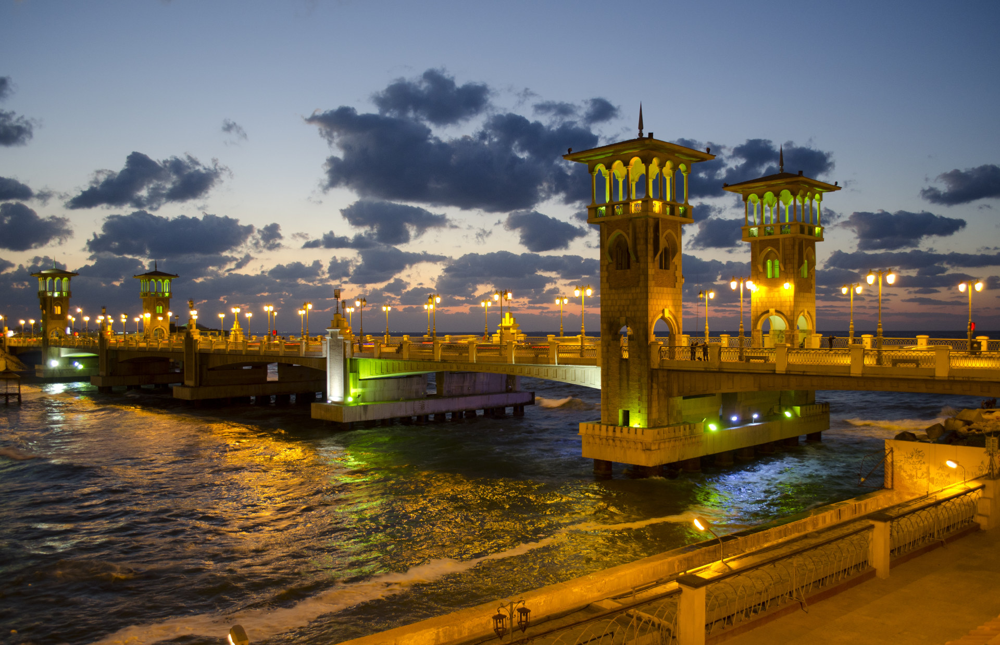

# Welcome everyone to my first post!

I've been working as a frontend web developer for over 5 years now. However, I've started recently to care about sharing my knowledge and my life with others.

  

I started that by creating my [YouTube channel](https://youtube.com/amrsekilly), and getting involved with the tech community in Egypt and the middle-east by providing mentorship, and contributing to the community on social media, events, etc.

> So, I'm planning to continue doing that in this blog. By sharing technical content, and also sharing more about my remote work lifestyle.

# A little about myself

I'm originally from Alexandria Egypt

  

I got my Electrical Engineering degree from Alexandria University there. And I've started working as a frontend web developer in 2015.

Currently, I'm working remotely at [Pelcro](https://pelcro.com). Which allowed me to be able to travel while working. 

# Remote life

Given the COVID-19 situation, I can't travel abroad. However, I'm taking this time to explore my lovely country.

  

Right now I'm staying in Dokki, overlooking my beloved island or Al Gezira, and Zamalek neighbourhood.

  

> Don't forget to subscribe to my blog to follow me on my journey. ✈️