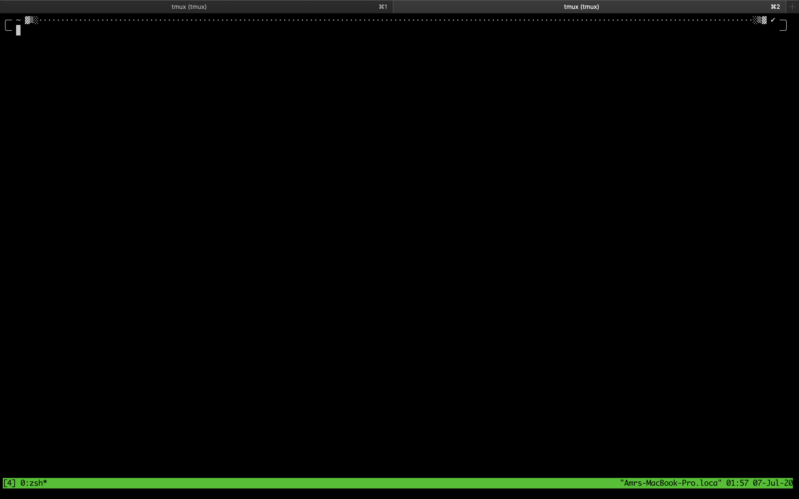
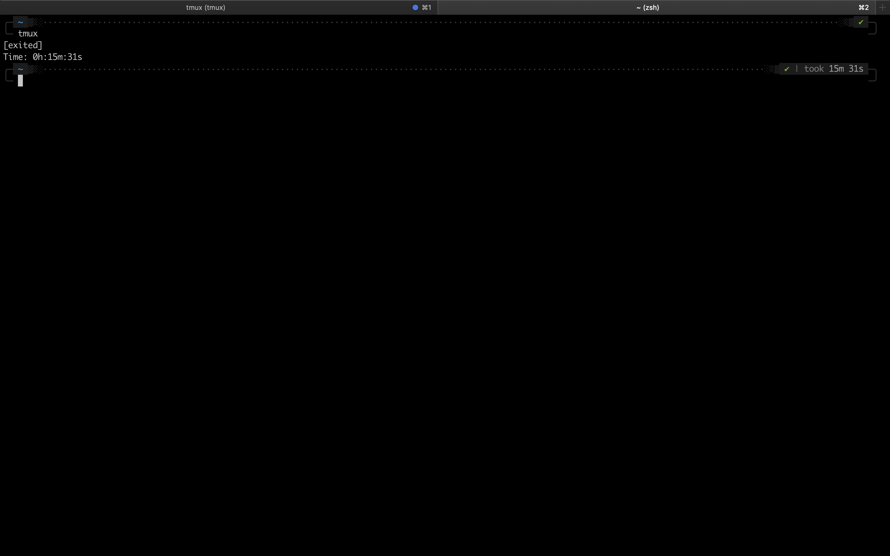
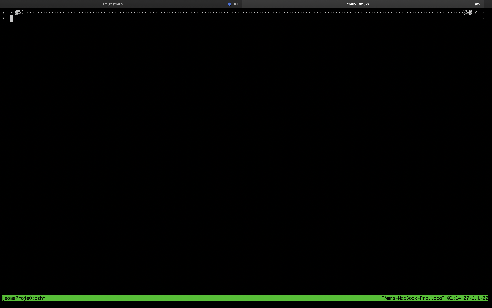
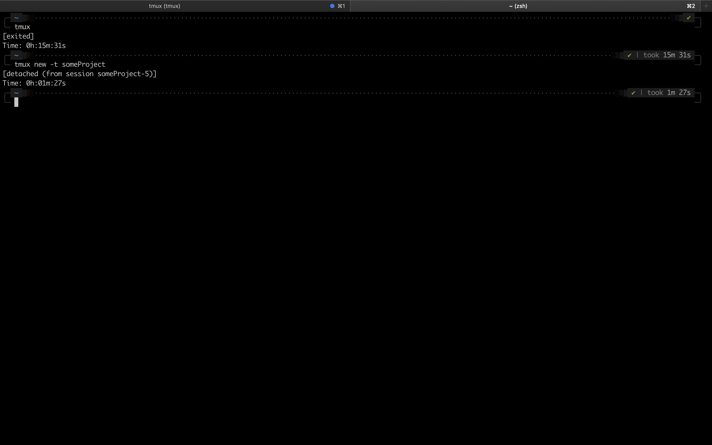
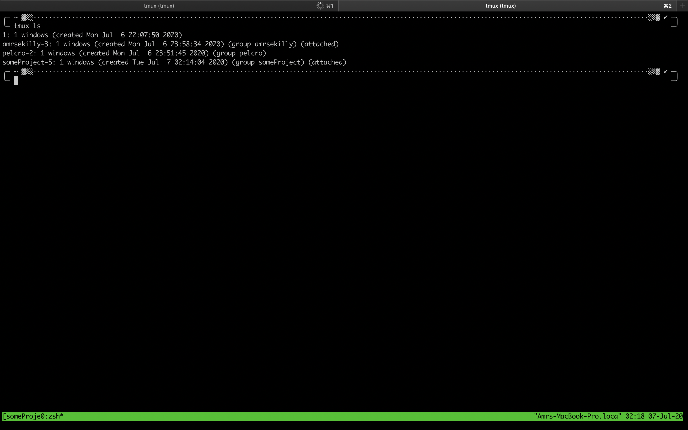
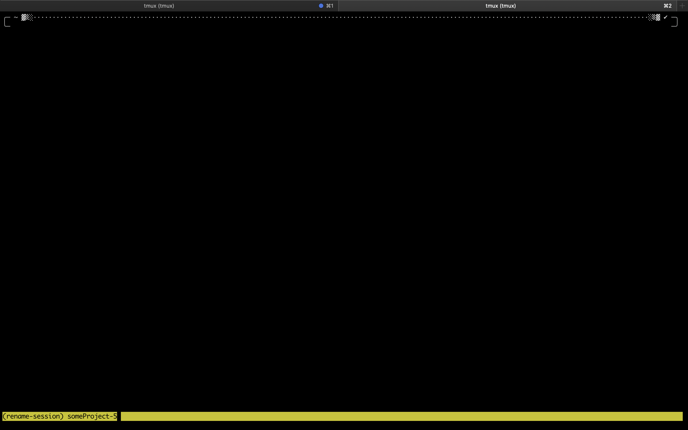
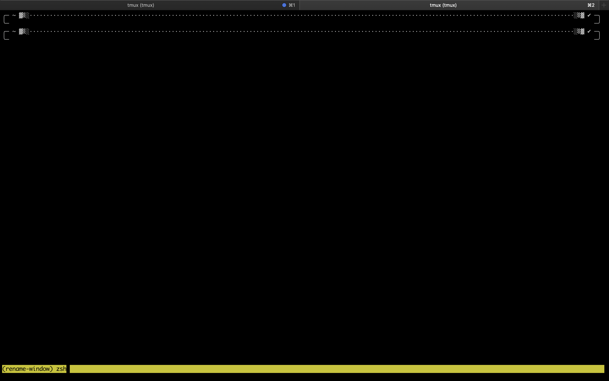
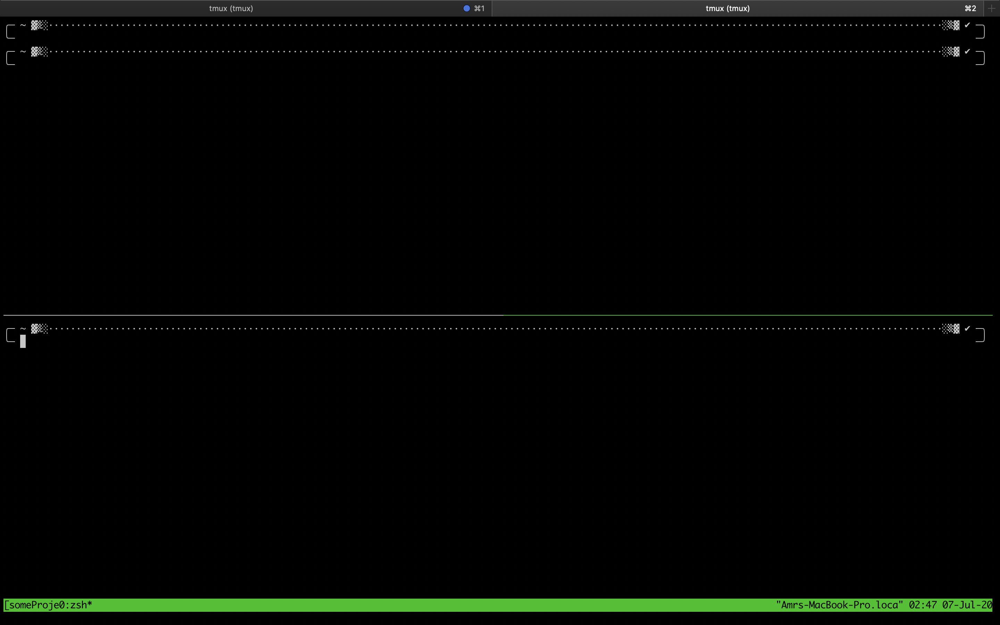
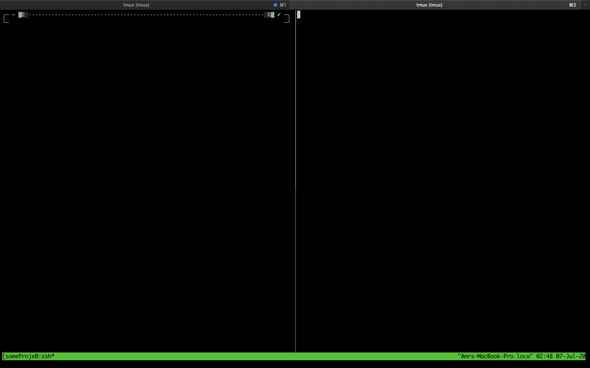

# TL;DR

Throughout the years, [tmux](https://github.com/tmux/tmux/wiki) has been on the top of the productivity tools that I use on a daily basis. It allows me to manage multiple projects simultaneously with ease in the terminal.

# What's tmux?

Simply put, tmux (Terminal Multiplexer) is a tool that you can use to easily manage working on projects in the terminal.

It allows you to have multiple sessions, in each session you can have multiple windows, and you can split each window into several panes.

You can think of a session as the biggest unit you could have in tmux, the window is a smaller part, and the panes are the smallest part of any window.


Any window could be split up to as many panes as you like. Personally, I prefer having at least 2 to 3 panes per project (window).

# My setup

Back in the days when I first started using tmux, I was using Linux as my main OS. But right now, I'm using it on MacOS version 10.15.3.

### My setup on Mac consists of

1. [iTerm2](https://www.iterm2.com/).
2. [tmux](https://github.com/tmux/tmux/wiki).

# Setting-up tmux on MacOS

- Install tmux via HomeBrew of OSX
   ````bash
   brew install tmux
   ````

- After downloaded, check the version
   ````bash
   tmux -V
   ````

- If you wanna start an unnamed session
    ```bash
    tmux
    ```
    

- To exit tmux
   ```bash
    exit
    ```
    

- To start a named session
   ```bash
    tmux new -t someProject
    ```
    

- If you wanna keep a session running in the background, but you don't wanna see it. You can detach a session.
    ```bash
    tmux detach
    ```
    

- If you wanna go back to a detached session. You can attach to it.
    ```bash
    tmux attach -t someProject
    ```

- To list all tmux sessions.
    ```bash
    tmux ls
    ```
    

- tmux prefix (the keys you press before any of the next shortcuts) is *control + b*.

- Change the session's number
    ```bash
    <prefix> + $
    ```
    

- Change Window Name
    ```bash
    <prefix> + ,
    ```
    

- Kill the Current Window
    ```bash
    <prefix> + &
    ```

- Split window into panes Vertically (top/bottom)
    ```bash
        <prefix> + "
    ```
    

- Split Horizontally (left/right)
    ```bash
        <prefix> + %
    ```
    

- Kill the Current Pane
    ```bash
        <prefix> + x
    ```
    or type
    ```bash
        exit
    ```

- Kill the existing sessions
    ```bash
    tmux kill-server
    ```

# Configuring the mouse for scrolling and navigation

I noticed an issue on MacOS using iTerm2, that the mouse can't resize the pane size's, it can't either scroll, nor can switch between panes. Sometimes using the mouse makes things easier.

### To get the mouse to work do the following

```bash
nano ~/.tmux.conf
```

Then paste this into the file

```bash
set-option -g mouse on
```

Save the file and run

```bash
tmux source ~/.tmux.conf
```

Voila, your mouse is functional in tmux now! 🚀🔥

> I hope that this article helps you become more productive at work. Don't forget to subscribe to my mailing list if you wanna get notified about new posts in the future.
