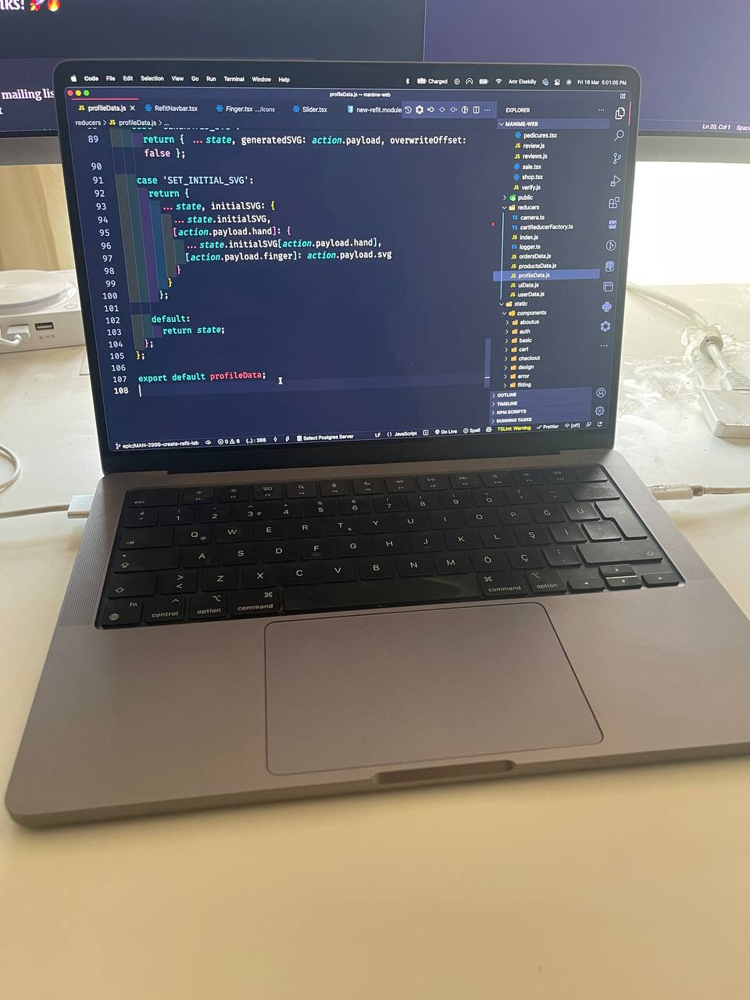
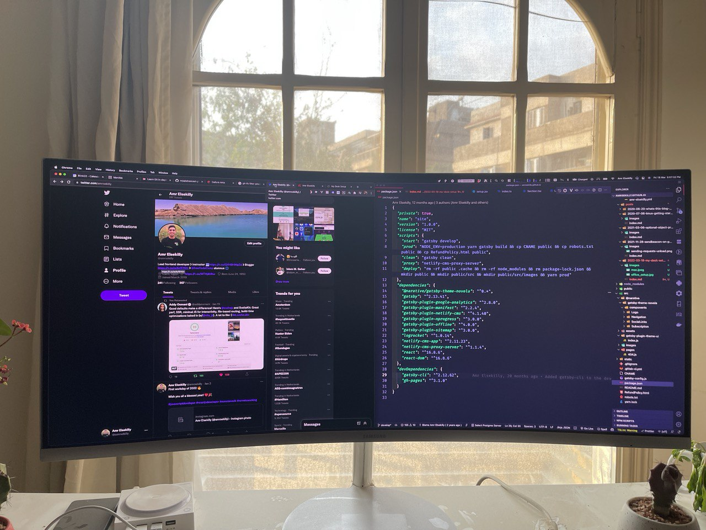

# Introduction

Many people asked me about my desk setup, my standing desk, office chair, laptop, and monitor. In this article, I'll be going through these items.

# If you like watching videos, you can watch my YouTube video here for the full review of my desk setup

<iframe width="560" height="315" src="https://www.youtube.com/embed/FBSBK32QsoI" title="YouTube video player" frameborder="0" allow="accelerometer; autoplay; clipboard-write; encrypted-media; gyroscope; picture-in-picture" allowfullscreen></iframe>

# My Laptop

I use the [16" MacBook Pro with M1 Pro chip](https://www.apple.com/eg/macbook-pro-14-and-16/) as my  main laptop, it provides me with all the hardware capabilities that I need in my day to day work. And it's very power effecient, which allows me to take it with me anywhere I go.

# My Monitor

I use the [34" Curved Gaming Monitor with Quantum dot technology](https://www.samsung.com/eg/monitors/ultra-wide/premium-curved-monitor-with-greater-viewing-comfort-perfect-multi-tasking-34-inch-lc34f791wqmxzn/) as my main monitor. In the past, I tried having multiple smaller monitors, but I guess havning a single monitor makes me much more productive. And I use the [Magnet App]
(https://apps.apple.com/us/app/magnet/id441258766?mt=12) to manage the windows in a better way and create better grids that make me more productive while working.

# My Chair 

I use the [JÄRVFJÄLLET IKEA Chair](https://www.ikea.com/eg/en/p/jaervfjaellet-office-chair-with-armrests-80510639/#content). In the past, I used to get back pain because of my old setup, after upgrading to this chair it helped me eliminate that pain, and now I'm able to work for longer hours without feeling any back pain. It's very ergonomic and comfortable, and I highly recommend getting it.

# My Standing Desk

I use the [BEKANT IKEA standing desk](https://www.ikea.com/eg/en/p/bekant-desk-sit-stand-white-black-s29022539/#content). Sometimes, working while standing helps me become more productive, but I realized that I don't use the standing mode that much. The big benifit of having a standing desk is that I can adjust it to the appropriate height while working, and that's something I didn't have in the past with normal desks.

> If you liked the article, please don't forget to subscribe to my mailing list, to get my future articles. Thanks! 🚀🔥

